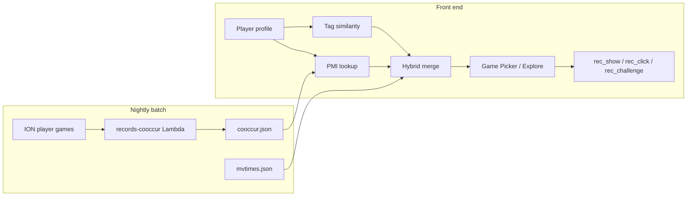

# Recommendations

Personalized game suggestions in the **Game Picker** and **Explore**. Impression events use surfaces `gamePicker` and `explore`.

---

## For players

### What are recommendations?

When you open the game picker, you may see a **"You might like"** carousel — games we think you might enjoy based on how you already play on the site. On Explore, you can optionally filter the catalog to **recommended games only**.

### How we pick games

- **Games you star** — explicit favourites count heavily.
- **Games you play most often** — if most of your games are Go, we lean toward games with similar goals and distinctive mechanics, not just anything you've tried once.
- **Games you're rated highly in** — competitive strength in a game is a signal you like that style.
- **What similar players play** — if many people who play your games also play another title, that's a strong hint (aggregate co-play only; no private data is exposed).
- **What's popular right now** — a small nudge toward active community favourites, especially if we don't know much about you yet.

We **never suggest games you've already completed** on Abstract Play.

### Variety

You'll see at most **two suggestions per broad goal type** (e.g. connection games, territory games) so the list stays varied.

### The one-line reason

Each suggestion includes a short explanation, such as:

- *"Similar to Go and Amazons"*
- *"Popular with players who play Chess"*
- *"Trending this week"* (especially if you're new or we have little history)
- *"New on Abstract Play"* or *"Recently added"*

### If you're new or barely logged in

Without much history, we show **popular and recent games** with the same variety rules — still useful, just less personalized.

### New games

Recently added games get a **temporary boost** in personalized recommendations (strongest right after launch, fading over about 90 days), especially when they match games you already enjoy. Explore's **Newest** view is another way to find new titles.

### Privacy

Recommendations use your **public play record** (completed games on the site), stars, and ratings summary — the same data visible on your profile. Logged-in users: we log which suggestions were shown and clicked so we can improve the feature. We do not sell this data.

### FAQ

- **Can I turn this off?** — In the Game Picker, use **Hide** / **Show game suggestions** (saved in your browser). Explore has a separate **Recommended games only** filter; uncheck it to see the full catalog again.
- **Why isn't game X listed?** — You've likely already played it, or it didn't rank highly for variety.
- **Why did this change overnight?** — Popularity and co-occurrence stats refresh nightly.
- **Does picking a suggestion and challenging count?** — Yes. If you choose a game from **You might like** and issue a challenge in the same browser tab, we log `rec_challenge` with the same batch id as the show/click events (unless you change your mind and pick a different game from the browse list).

### Where to find it

| Surface | Location |
|---------|----------|
| Game Picker | **You might like** carousel when choosing a game (logged-in or cold-tier picks for anonymous) |
| Explore | **Recommended games only** checkbox on the All Games view |

See also: [Explore](/front/subsystems/explore/) for catalog browsing and tag filters.

---

## For developers

Hybrid recommender: **content-based tag similarity** + **PMI co-occurrence** + **popularity** + **recency**, with **cold/warm** tier routing and a **max 2 per top-level goal** diversity cap.



Backend event storage (`log_recommendation_event`, DynamoDB `RECOMMENDS#`) is documented in the [backend recommendations doc](/backend/subsystems/recommendations/).

### Key files

| File | Role |
|------|------|
| [`recommendationTagFeatures.js`](../src/lib/recommendationTagFeatures.js) | Tag → weighted feature vector |
| [`playerRecommendationProfile.js`](../src/lib/playerRecommendationProfile.js) | Taste profile, `playShare`, played set, tier |
| [`gameRecommendations.js`](../src/lib/gameRecommendations.js) | Scoring, merge, diversity cap, explanations |
| [`recommendationTracking.js`](../src/lib/recommendationTracking.js) | Impression events |
| [`recommendationAttribution.js`](../src/lib/recommendationAttribution.js) | Session attribution for `rec_challenge` funnel |
| [`useGameRecommendations.js`](../src/hooks/useGameRecommendations.js) | Data fetch + hook API |
| [`GamePickerModal.js`](../src/components/GamePickerModal.js) | Primary UI — carousel, show/hide |
| [`Explore/ExploreView.js`](../src/components/Explore/ExploreView.js) | Recommended-only filter |

### Profile weights

Per meta-game `profileWeight`:

```
  3.0 * isStarred
+ 2.0 * isTopRated
+ 1.0 * playShare          // playCount / totalPlays across completed games
+ 0.5 * isRecentlyPlayed   // last 5 unique games
```

**Cold tier:** not logged in, or fewer than 2 distinct played meta-games and fewer than 1 starred game. Uses popularity + newest fill.

**Warm tier:** full hybrid scoring.

### Tag weights (content similarity)

Implemented in `gameRecommendationFeatures()`. Parent-prefix expansion applies to included tags.

#### Goal, components, board

| Feature type | Source | Weight |
|--------------|--------|--------|
| Goal tags | `goal>*` | **1.0** |
| Component tags | `components>*` | **0.4** |
| Root board tags | `board>dynamic`, `board>none`, `board>3d`, etc. | **0.3** |
| Standard board | synthetic `board>hasStandardBoard` when any `board>shape>*` exists | **0.25** |

**Excluded from scoring:** `board>shape>*`, `board>connect>*` (still used for Explore browse filters).

#### Mechanic tags (fine-grained)

| Rule | Tags | Weight |
|------|------|--------|
| Ignored | `mechanic>capture`, `mechanic>move`, `mechanic>place` (+ descendants) | omitted |
| Elevated | `mechanic>asymmetry`, `differentiate`, `economy`, `hidden`, `network`, `program`, `random` (+ `random>*`), `simultaneous` | **0.85** |
| Default | all other `mechanic>*` | **0.7** |

Constants: `IGNORED_MECHANIC_PREFIXES`, `ELEVATED_MECHANIC_PREFIXES`, `mechanicTagWeight()`.

Changing tag weights does **not** require regenerating `cooccur.json`.

### Hybrid score (warm tier)

```
score =
    0.45 * contentScore
  + 0.35 * cooccurScore
  + 0.15 * popularityNorm
  + 0.10 * recencyScore
```

`computeRecencyScore`: linear decay from 1.0 at launch to 0 over **90 days** (`NEW_GAME_WINDOW_DAYS`).

Diversity cap: max **2** per top-level goal bucket (`goal>{firstSegment}`); relaxes to 3 only if fewer than `limit` results.

### External data

| Artifact / API | URL | Cadence |
|----------------|-----|---------|
| Co-occurrence | `records.abstractplay.com/recommendations/cooccur.json` | Nightly 03:00 UTC (`records-cooccur`) |
| Popularity | `records.abstractplay.com/mvtimes.json` | Nightly |
| Player history | `records.abstractplay.com/player/{id}.json` | Nightly |
| Impression events | `log_recommendation_event` → DynamoDB `RECOMMENDS#<userid>` | Real-time write; no live reads by recommender |
| Impression analytics | Private ops S3 `recommendations/analytics/` | Nightly 03:00 UTC (`records-rec-analytics`) — **not consumed by the client** |

Offline funnel/CTR rollups (shows, clicks, challenges by surface/tier/reason) are written to a private ops bucket for human or agent review. See [Recommendation analytics](/crons/recommendations-analytics/) in backend-crons. The live recommender does **not** read these artifacts; `tuning.json` remains deferred.

Co-occurrence artifact schema (simplified):

```json
{
  "generatedAt": "2026-08-13T00:00:00Z",
  "minCooccurrence": 5,
  "includeStarredBoost": true,
  "games": {
    "go": [{ "metaGame": "amazons", "pmi": 1.42, "count": 87 }]
  }
}
```

PMI: `log(count(A,B) * N / (count(A) * count(B)))`, pairs with `count >= 5`, top 20 neighbors per game.

### Impression tracking (client)

| Event | When |
|-------|------|
| `rec_show` | Recommendation batch rendered (once per `batchId`) |
| `rec_click` | User selects a recommended game |
| `rec_challenge` | Challenge or standing challenge succeeds for a game picked from the recommendation carousel (same `batchId`) |

Fire-and-forget via `recommendationTracking.js`; `callAuthApi(..., false)` so failures never block UI.

#### Attribution (`rec_challenge`)

Session-scoped key `ap-rec-attribution` in `sessionStorage` links carousel picks to later challenges:

1. **Write** on recommended carousel click in `GamePickerModal` (`batchId`, `surface: "gamePicker"`, `tier`, `metaGame`).
2. **Clear** when the user picks from the browse list or quick-pick rows instead.
3. **Consume** after a successful `new_challenge` or `update_standing` — `maybeTrackRecommendationChallenge(metaGame)` fires `rec_challenge` only when `metaGame` matches, then clears storage. A mismatch clears without firing.

Tab close clears attribution; no server-side session.

### Testing

- [`recommendationTagFeatures.test.js`](../src/lib/recommendationTagFeatures.test.js) — tag weights, goal buckets
- [`gameRecommendations.test.js`](../src/lib/gameRecommendations.test.js) — diversity cap, cold tier, hybrid co-occurrence
- [`recommendationTracking.test.js`](../src/lib/recommendationTracking.test.js) — event payloads
- [`recommendationAttribution.test.js`](../src/lib/recommendationAttribution.test.js) — save/clear/match funnel
- [`useGameRecommendations.test.js`](../src/hooks/useGameRecommendations.test.js) — `cooccur.json` fetch fallback

### Related

- [Explore](/front/subsystems/explore/) — catalog, tag filters, recommended-only checkbox
- [Gameslib](/gameslib/) — `gameinfo.categories`, `dateAdded`
- [Backend recommendations](/backend/subsystems/recommendations/) — DynamoDB events, API schema
- Records: `docs/recommendations-cooccur.md` (backend repo) — PMI batch job
- [Recommendation analytics](/crons/recommendations-analytics/) — nightly impression funnel rollups (ops S3)
